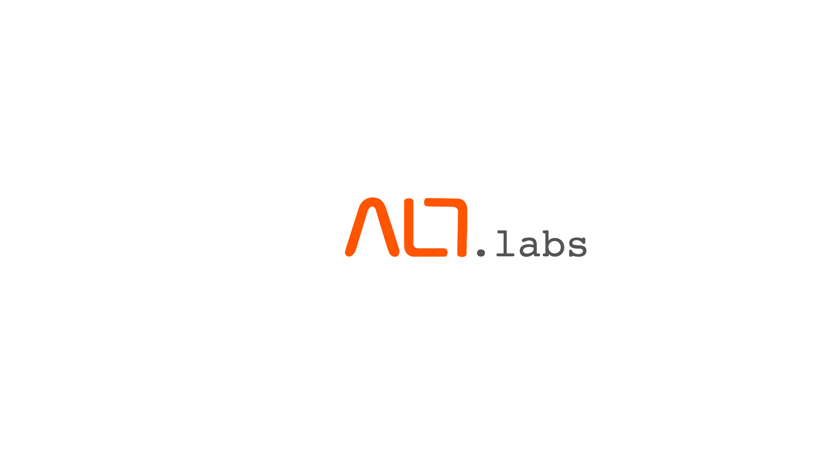

#### About this repository

This repository is meant to be the reference source of all the codes and training materials used for the ALT.Labs monthly community session organized by Oxygen. The materials will grow with a collection of interesting and useful materials relevant in Industry 4.0.

Some codes are represented in IPython notebooks, because they offer a convenient way for describing the algorithm, benchmarking, maybe even visualization, and eventually sharing and viewing.

 
 

# Alt Labs Series

### Python for Data Analysis
- Python Crash Course
- Numpy
- Pandas
- Matplotlib

 

### Introduction to Supervised and Unsupervised Learning
- Machine Learning Introduction
- Supervised Regression
- Supervised Classification
- Unsupervised k-means Clustering

 

### Introduction to Deep Learning and Keras
- Deep Learning Introduction
- MNIST Handwritten Digit Classification
- Keras.models.Sequential() introduction
- Basic Neural network architecture and intro to epochs, batch size, optimizers